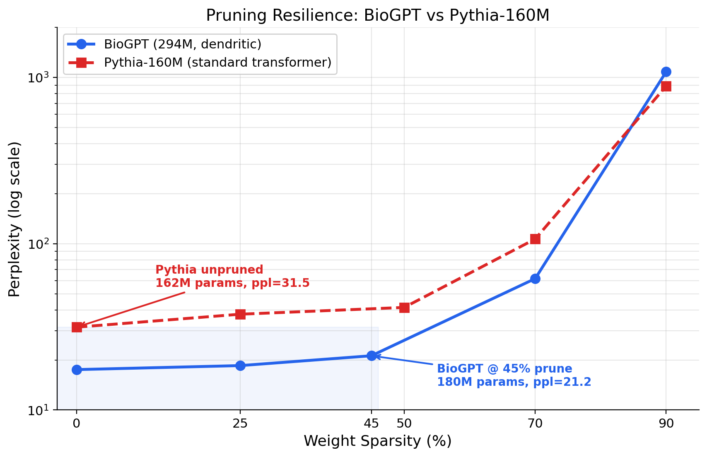
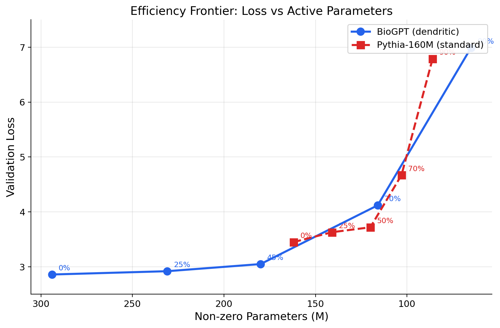
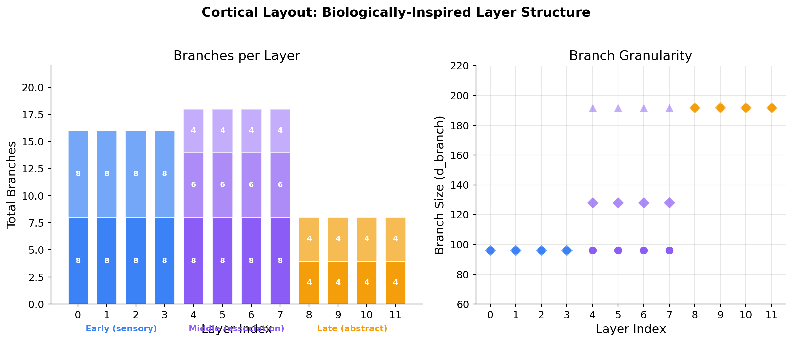
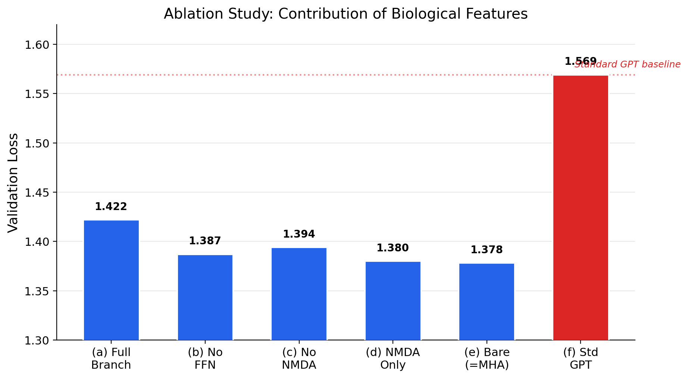

# BioGPT: A Biologically-Inspired Dendritic Language Model

**A novel neural architecture that replaces standard transformer attention with dendritic neurons, cortical columns, and feedback connections inspired by mammalian neocortex -- and beats Pythia-160M after pruning nearly half its weights.**

---

## TL;DR

We built a language model where each "attention layer" is replaced by **biologically realistic neurons with dendritic branches, NMDA-like temporal memory, per-neuron processing, and cortical feedback loops**. Trained on 2B tokens of The Pile, BioGPT achieves a perplexity of **21.2 after pruning 45% of its weights** -- outperforming the unpruned Pythia-160M transformer (perplexity 31.5) at roughly the same parameter count. The dendritic architecture distributes knowledge more efficiently across its weights, making it naturally resilient to pruning -- just like biological synaptic pruning in the developing brain.

---

## Key Result: Pruning Resilience

The headline finding: **BioGPT retains strong performance even after aggressive weight removal**, while the standard transformer degrades rapidly.

| Model | Active Params | Val Loss | Perplexity |
|---|---|---|---|
| **BioGPT (unpruned)** | 294M | 2.86 | 17.5 |
| **BioGPT (45% pruned)** | **180M** | **3.05** | **21.2** |
| Pythia-160M (unpruned) | 162M | 3.45 | 31.5 |
| Pythia-160M (25% pruned) | 141M | 3.63 | 37.7 |

> At roughly equal parameter counts (~180M vs ~162M), the pruned BioGPT beats unpruned Pythia by **0.40 loss / 10 perplexity points**.

### Full Pruning Curves



| Sparsity | BioGPT Params | BioGPT PPL | Pythia Params | Pythia PPL |
|---|---|---|---|---|
| 0% | 294M | 17.5 | 162M | 31.5 |
| 25% | 231M | 18.5 | 141M | 37.7 |
| 45-50% | 180M | 21.2 | 120M | 41.4 |
| 70% | 116M | 61.7 | 103M | 106.8 |
| 90% | 65M | 1,084 | 86M | 889 |

BioGPT's curve stays flat through 25% pruning and degrades gracefully through 45%. Both architectures break down at 90%, but BioGPT holds a consistent advantage through 70%.



---

## Architecture

BioGPT replaces the standard transformer block with a biologically-motivated hierarchy:

```
Input Tokens
     |
     v
[Token + Position Embedding]
     |
     v
+--[Cortical Layer 0-3 (EARLY)]---+     Gated Feedback
|  2 neurons x 8 branches each    |  <--- (deep -> early)
|  Fine-grained pattern detection  |          |
+----------------------------------+          |
     |                                        |
     v                                        |
+--[Cortical Layer 4-7 (MIDDLE)]---+          |
|  3 neurons x [8,6,4] branches    |          |
|  Multi-scale association          |          |
+----------------------------------+          |
     |                                        |
     v                                        |
+--[Cortical Layer 8-11 (LATE)]----+----------+
|  2 neurons x 4 branches each    |
|  Abstract reasoning / output     |
+----------------------------------+
     |
     v
[LayerNorm -> LM Head -> Logits]
```

### Inside Each Neuron

Each `EfficientBioNeuron` implements the full dendritic processing pipeline using GPU-efficient batched operations:

```
Input (B, T, 768)
     |
     +---> [Multi-Head Attention]  (branches = heads, with NMDA-enriched V)
     |          |
     |          v
     |     [Causal Temporal Conv1d]  (local dendritic integration, kernel=5)
     |          |
     |          v
     |     [Per-Branch FFN]  (grouped Conv1d -- each branch has own weights)
     |          |
     |          v
     |     [Per-Branch GroupNorm]  (per-position, no cross-position leakage)
     |          |
     +----<----+  (residual)
     |
     v
[Soma Projection + Per-Neuron FFN]  (each neuron has its own cell body)
     |
     v
Output (B, T, 768)
```

### Biological Feature Mapping

| Architecture Component | Biological Inspiration | Implementation |
|---|---|---|
| **Dendritic branches** | Dendrites on pyramidal neurons | Multi-head attention (each head = branch) |
| **NMDA temporal trace** | NMDA receptor slow decay current | Learnable exponential decay enriching V |
| **Causal Conv1d** | Local dendritic integration | Depthwise causal convolution (kernel=5) |
| **Per-branch FFN** | Dendritic computation | Grouped Conv1d (separate weights per branch) |
| **Per-branch norm** | Local dendritic homeostasis | GroupNorm (per-position to prevent leakage) |
| **Soma FFN** | Cell body integration | Per-neuron feed-forward network |
| **Cortical columns** | Neocortical minicolumns | Multiple neurons per layer with softmax competition |
| **Cortical layout** | Sensory->Association->Motor hierarchy | Early: many small branches, Late: few large branches |
| **Gated feedback** | Layer 5/6 -> Layer 2/3 projections | Learned sigmoid gate on deep->early connections |
| **Magnitude pruning** | Synaptic pruning during development | Remove smallest weights globally |
| **Dead neuron removal** | Neuronal apoptosis | Kill neurons with >95% weights pruned |

### Cortical Layout

The layer structure varies across depth, inspired by the sensory->association->motor hierarchy in biological cortex:



- **Early layers (0-3)**: 2 neurons x 8 branches each (96-dim branches) -- fine-grained feature extraction
- **Middle layers (4-7)**: 3 neurons x [8,6,4] branches -- multi-scale pattern association
- **Late layers (8-11)**: 2 neurons x 4 branches each (192-dim branches) -- coarse abstract reasoning

---

## Ablation Study

Which biological features actually matter? We tested each component in isolation:



| Configuration | Val Loss | Description |
|---|---|---|
| (a) Full Branch | 1.422 | All features: attention + FFN + NMDA + conv + norm |
| (b) No FFN | 1.387 | Remove per-branch FFN |
| (c) No NMDA | 1.394 | Remove temporal memory trace |
| (d) NMDA Only | 1.380 | Only attention + NMDA (minimal branch) |
| (e) Bare (=MHA) | 1.378 | Standard multi-head attention only |
| **(f) Std GPT** | **1.569** | Standard GPT transformer block |

**Key finding**: Every dendritic variant significantly beats the standard GPT architecture (1.38-1.42 vs 1.57). The individual components show diminishing returns at small scale, but the full combination shines at scale with pruning -- where the redundancy built into the branch structure provides resilience.

---

## Quick Start

### Installation

```bash
git clone https://github.com/lukehamond1001-alt/biogpt-dendritic.git
cd biogpt-dendritic
pip install -r requirements.txt
```

### Verify the Architecture

```bash
python -m biogpt.model
```

This prints the cortical layout, parameter counts, and runs a forward pass test.

### Train from Scratch

```bash
# 1. Prepare data (streams from The Pile, tokenizes with GPT-NeoX tokenizer)
python -m biogpt.prepare_data --target_tokens 2000000000 --out_dir data

# 2. Train (requires CUDA GPU, ~22 hours on RTX 4090)
python -m biogpt.train --data_dir data --out_dir checkpoints --n_passes 1

# 3. Generate text
python -m biogpt.generate --checkpoint checkpoints/biogpt_final.pt \
    --prompt "The theory of relativity" --max_tokens 100
```

### Run the Full Comparison

```bash
bash scripts/run_comparison.sh
```

This runs the complete BioGPT vs Pythia-160M pipeline: generation comparison, validation loss, and pruning curves at 0%/25%/45%/70%/90% sparsity.

### Regenerate Charts

```bash
python scripts/generate_charts.py
```

---

## Training Details

| Parameter | Value |
|---|---|
| Dataset | The Pile (same as Pythia) |
| Tokens | 2 billion |
| Tokenizer | GPT-NeoX-20B (vocab 50,304) |
| Sequence length | 1,024 |
| Batch size | 4 micro x 8 accumulation = 32 effective |
| Optimizer | AdamW (betas 0.9/0.95, wd=0.1) |
| Learning rate | 6e-4 max, 6e-5 min (cosine with 500-step warmup) |
| Precision | bfloat16 mixed precision |
| Gradient checkpointing | Enabled (trades compute for memory) |
| Hardware | NVIDIA RTX 4090 (24GB) |
| Training time | ~22 hours |

### Comparison Baseline

Pythia-160M at its step-1000 checkpoint (2B tokens on The Pile). Same tokenizer, same data, same token budget -- the only variable is the architecture.

---

## Pruning Methodology

Our pruning pipeline mirrors biological synaptic pruning:

1. **Magnitude pruning** (synaptic pruning): Remove the smallest-magnitude weights globally across all prunable layers (skip embeddings, norms, and NMDA parameters)
2. **Dead neuron removal** (apoptosis): If >95% of a neuron's weights are pruned, zero out all remaining weights -- a mostly-disconnected neuron provides no useful computation
3. **Fine-tuning with mask** (recovery): 500 steps of fine-tuning with a binary mask that keeps pruned weights at zero, allowing the surviving network to adapt
4. **Re-evaluation**: Measure val loss and perplexity on held-out data

---

## Project Structure

```
biogpt-dendritic/
  biogpt/
    model.py          # BioGPT architecture (EfficientBioNeuron, CorticalLayer, etc.)
    train.py          # Training loop with mixed precision + gradient checkpointing
    compare.py        # BioGPT vs Pythia comparison + pruning pipeline
    prepare_data.py   # Stream and tokenize The Pile
    generate.py       # Text generation from checkpoint
  results/
    phase3_comparison.json   # Final BioGPT vs Pythia results
    ablation_results.json    # Ablation study data
  scripts/
    generate_charts.py       # Regenerate all figures
    run_comparison.sh        # One-command full pipeline
  assets/                    # Charts and figures
  docs/
    ARCHITECTURE.md          # Deep dive into the architecture
    RESULTS.md               # Detailed results analysis
    REPRODUCTION.md          # Full reproduction guide
```

---

## Roadmap

This is an active research direction. Key next steps:

- [ ] **Scale to 1B+ parameters** -- Test whether the pruning resilience advantage holds (or grows) at larger scale
- [ ] **Instruction tuning** -- Fine-tune on instruction-following data to produce a chat-capable BioGPT
- [ ] **Fix NMDA state propagation** -- Currently disabled during training due to gradient checkpointing; implement custom checkpoint-compatible state passing
- [ ] **Structured pruning** -- Move beyond unstructured magnitude pruning to remove entire branches/neurons for actual inference speedup
- [ ] **Standard benchmarks** -- Evaluate on HellaSwag, PIQA, WinoGrande, ARC, LAMBADA for published comparisons
- [ ] **Multi-pass refinement** -- Re-enable the 2-pass feedback mechanism and measure its impact at scale
- [ ] **Dynamic branch gating** -- Let the model learn to activate different branches for different inputs (mixture-of-dendrites)
- [ ] **Biological learning rules** -- Replace backprop with Hebbian or STDP-like local learning rules for branches

---

## Citation

```bibtex
@software{biogpt_dendritic_2026,
  title     = {BioGPT: A Biologically-Inspired Dendritic Language Model},
  author    = {Hamond, Luke},
  year      = {2026},
  url       = {https://github.com/lukehamond1001-alt/biogpt-dendritic},
  note      = {Dendritic neurons with NMDA traces, cortical columns,
               and gated feedback for pruning-resilient language modeling}
}
```

---

## License

MIT License. See [LICENSE](LICENSE).
